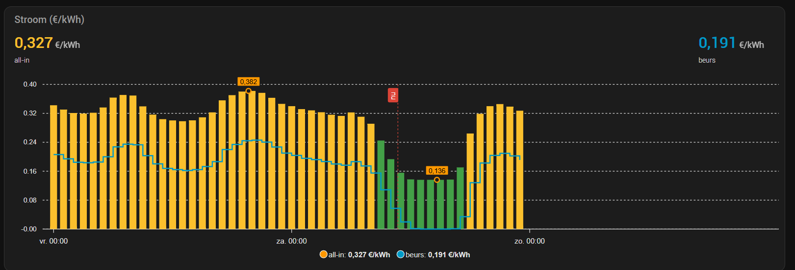

<p align="center">
  
</p>

# DynTarNL — Dynamische stroom- & gastarieven (NL)

[](https://github.com/mvanrijnen/ha-dyntarNL/actions/workflows/test.yml)
[](https://github.com/mvanrijnen/ha-dyntarNL/actions/workflows/validate.yml)
[](https://github.com/hacs/integration)
[](https://github.com/mvanrijnen/ha-dyntarNL/releases)

Home Assistant integratie die de **dynamische energietarieven van meerdere Nederlandse
leveranciers** als sensoren publiceert. Je kiest je leverancier; de integratie bepaalt zelf
welk platform en welke publieke prijs-API erbij hoort. **Geen account of API-sleutel nodig**
voor de ondersteunde leveranciers.

> ## Stabiel — klaar voor dagelijks gebruik
>
> De integratie draait in productie en de entiteiten liggen vast: vanaf 1.0 verandert er niets
> meer aan bestaande `entity_id`'s zonder een major release. Niet elke leverancier is even
> uitgebreid in de praktijk beproefd — wijkt een prijs af, meld het gerust.
> Onofficieel; geen affiliatie met de genoemde leveranciers.
>
> Feedback en bugreports zijn welkom via de [issues](https://github.com/mvanrijnen/ha-dyntarNL/issues).

## Ondersteunde leveranciers

Je kiest je merk in de config-flow; het **platform** wordt automatisch bepaald. Alleen
leveranciers die een **volledige, exacte uitsplitsing** (beurs + opslag + belasting) via een
publieke API leveren staan in de lijst — dan hoef je niets in te vullen. Alle andere
leveranciers gebruik je via **CUSTOM**.

| Leverancier | Platform | Uitsplitsing |
| --- | --- | --- |
| Essent, Energiedirect | eon-app | volledig (beurs + opslag + belasting) |
| Frank Energie | frank | volledig |
| EasyEnergie | easyenergy | volledig |
| **Eigen leverancier (handmatig)** | custom | jij vult opslag + belasting + btw in |

**Waarom niet elke leverancier in de lijst?** Sommige bronnen geven **alleen een
marktprijs** door, geen opslag/all-in — dan zouden we een verkeerde all-in tonen. Voor die
leveranciers is **CUSTOM** de juiste route:

- **EnergyZero-merken** (ANWB, Coolblue, Energie VanOns, GroeneStroomLokaal, SamSam, Hegg,
  EnergyZero): de API geeft alleen de marktprijs.
- **Nieuwestroom**: heeft een dynamische opslag die niet in de API zit.
- **Login-only** leveranciers (**Vattenfall, Eneco, Tibber, Greenchoice, Zonneplan, ENGIE,
  DELTA, Vandebron, OXXIO** e.a.): geen publieke prijs-API.

Bij **CUSTOM** vul je éénmalig je opslag + energiebelasting (excl. btw) + btw in; de EPEX-
beursprijs (voor iedereen gelijk) wordt automatisch opgehaald en je all-in exact berekend.

## Entiteiten (referentie)

Je kiest **één** leverancier; de `entity_id`'s bevatten daarom **geen** leverancier-naam.
De namen zijn **compact & Engels** (alleen `a-z0-9_`). Je krijgt drie devices:
**DynTarNL E** (stroom), **DynTarNL G** (gas) en **DynTarNL** (voor de knop). De gekozen
leverancier staat als *fabrikant* op de device-pagina. Bedragen incl. btw, in €/kWh (stroom)
of €/m³ (gas).

> Stroom is per uur; **gas** volgt de Nederlandse **gasdag** (06:00–06:00): de prijs verspringt
> om 06:00 en is daartussen constant.

### Prijs-sensoren (import) — stroom & gas, all-in & beurs

`X` = `e` (stroom) of `g` (gas), `Y` = `all_in` of `market`.

| entity_id | Betekenis |
| --- | --- |
| `sensor.dyntarnl_X_Y_prev` | Prijs van het vorige uur |
| `sensor.dyntarnl_X_Y_now` | Prijs van het huidige uur (met `today`/`tomorrow` als attribuut) |
| `sensor.dyntarnl_X_Y_next` | Prijs van het eerstvolgende uur |
| `sensor.dyntarnl_X_Y_today_min` / `_today_avg` / `_today_max` | Laagste / gemiddelde / hoogste vandaag |
| `sensor.dyntarnl_X_Y_tomorrow_min` / `_tomorrow_max` | Laagste / hoogste morgen (leeg tot gepubliceerd) |

Bijv. `sensor.dyntarnl_e_all_in_now`, `sensor.dyntarnl_g_market_today_avg`.

### Component-sensoren (opbouw huidig uur)

| entity_id | Betekenis |
| --- | --- |
| `sensor.dyntarnl_X_tax_incl_vat` / `_tax_excl_vat` | Energiebelasting per eenheid |
| `sensor.dyntarnl_X_markup_incl_vat` / `_markup_excl_vat` | Opslag (markup) van de leverancier |

### Export-sensoren (teruglevering, alleen stroom = `e`)

| entity_id | Waarde |
| --- | --- |
| `sensor.dyntarnl_e_export_price_now` | €/kWh voor export dit uur (kan negatief) |
| `sensor.dyntarnl_e_export_cost_now` / `_export_cost_next` | €/kWh die export kost (0 = kost niets) |
| `sensor.dyntarnl_e_neg_hours_today` | aantal uren met beursprijs < 0 |
| `sensor.dyntarnl_e_export_loss_today` | aantal uren dat export geld kost |

### Binary sensors (triggers, alleen stroom = `e`)

| entity_id | Aan wanneer |
| --- | --- |
| `binary_sensor.dyntarnl_e_neg_price_now` / `_neg_price_prev` / `_neg_price_next` | beursprijs < 0 |
| `binary_sensor.dyntarnl_e_export_loss_now` / `_export_loss_next` | export levert niets op (beurs ≤ opslag) |
| `binary_sensor.dyntarnl_e_tomorrow_available` / `..._g_...` | prijzen van morgen gepubliceerd |

### Knop / actions

| Aanroep | Wat |
| --- | --- |
| `button.dyntarnl_refresh` (via `button.press`) | Knop op de device-pagina; verse data ophalen |
| **`dyntarnl.refresh`** | Service — overal aanroepbaar, ververst de tarieven direct |

```yaml
# overal aanroepbaar, bijv. in een automatisering of script:
action: dyntarnl.refresh
```

### Attributen op de `now`-prijssensor

De `now`-prijssensoren dragen alle uren mee die de integratie in cache heeft:

- `prices` — **kant-en-klare grafiekreeks** over álle dagen: lijst van `[epoch-ms, prijs]`
- `yesterday` / `today` / `tomorrow` — lijst van `{ start, end, price }`, handig in templates
  (`yesterday` en `tomorrow` zijn `null` zolang die dag er niet is)
- `market_price`, `purchase_fee`, `energy_tax` — opbouw van het huidige uur
- `unit`, `vat_percentage`

De prijs is steeds die van de sensor zelf: op `..._all_in_now` staan de all-in prijzen, op
`..._market_now` de beursprijzen.

### Voorbeeld-kaart: all-in én beurs in één grafiek

`prices` staat al in het formaat dat [ApexCharts](https://github.com/RomRider/apexcharts-card)
verwacht, dus de `data_generator` is per serie één regel. Elke `now`-sensor draagt zijn eigen
reeks: `..._all_in_now` de all-in prijzen, `..._market_now` de kale beurs.



> De kaart ververst zichzelf elke 5 minuten. Dat is nodig omdat apexcharts-card standaard
> alleen hertekent bij een **state**-wijziging, terwijl deze grafiek uit de **attributen** leest:
> zonder `update_interval` verschijnen de prijzen van morgen pas zodra de prijs van het huidige
> uur verandert.

*De kolommen zijn de all-in prijs — groen onder €0,25, geel daarboven. De blauwe stepline is de
kale beurs; het verschil ertussen is je opslag + energiebelasting. De stippellijn is `nu`. Het
laatste etmaal is nog leeg omdat de prijzen van morgen op dat moment nog niet gepubliceerd waren.*

```yaml
type: custom:apexcharts-card
grid_options:
  columns: full          # volle breedte in de sections-weergave
experimental:
  color_threshold: true
header:
  show: true
  title: Stroom (€/kWh)
  show_states: true
  colorize_states: true
update_interval: 5min    # kaart leest attributen; zonder dit hertekent hij pas
                         # als de prijs van het huidige uur verandert
graph_span: 72h          # gisteren + vandaag + morgen
span:
  start: day
  offset: -1d            # begin bij gisteren 00:00, anders valt die dag buiten beeld
now:
  show: true
  label: nu
  color: var(--error-color)
yaxis:
  - min: ~0              # zachte nul: zakt mee als de beurs negatief wordt
    max: ~0.40
    decimals: 2
apex_config:
  chart:
    height: 320px
  tooltip:
    x:
      format: ddd d MMM - HH:mm
  xaxis:
    labels:
      format: ddd HH:mm  # zonder dagnaam leest elk label '00:00'
series:
  - entity: sensor.dyntarnl_e_all_in_now
    name: all-in
    type: column
    extend_to: false     # niet doortrekken tot het eind van het venster
    float_precision: 3
    unit: " €/kWh"
    show:
      extremas: true
      header_color_threshold: true
    color_threshold:
      - value: -1
        color: "#1b5e20"
      - value: 0
        color: "#43a047"
      - value: 0.25
        color: "#fbc02d"
      - value: 0.40
        color: "#e53935"
    data_generator: |
      return entity.attributes.prices;
  - entity: sensor.dyntarnl_e_market_now
    name: beurs
    type: line
    curve: stepline
    stroke_width: 2
    color: var(--primary-color)
    extend_to: false
    float_precision: 3
    unit: " €/kWh"
    data_generator: |
      return entity.attributes.prices;
```

Het verschil tussen de lijn en de kolommen is precies je opslag + energiebelasting.

**Alleen de beurs?** Laat de eerste serie weg en zet de drempels lager — beursprijzen liggen
een stuk dichter bij nul en duiken er regelmatig onder:

```yaml
    color_threshold:
      - value: -0.02
        color: "#1b5e20"
      - value: 0
        color: "#43a047"
      - value: 0.10
        color: "#fbc02d"
      - value: 0.20
        color: "#e53935"
```

Voor gas werkt dezelfde kaart met `sensor.dyntarnl_g_all_in_now` / `..._g_market_now`; die
tekent blokken van de gasdag (06:00–06:00). Zolang de prijzen van morgen nog niet gepubliceerd
zijn blijft het laatste etmaal leeg.

### Voorbeeld-automatisering: ZeroExport bij ongunstige teruglevering

```yaml
automation:
  - alias: ZeroExport aan/uit op teruglevering
    trigger:
      - platform: state
        entity_id: binary_sensor.dyntarnl_e_export_loss_now
    action:
      - service: "switch.turn_{{ 'on' if trigger.to_state.state == 'on' else 'off' }}"
        target: { entity_id: switch.omvormer_zero_export }
```

## Automatische detectie van platform, opslag & tarieven

Je kiest alleen je **merk**; de integratie regelt de rest zelf:

1. **Platform-detectie.** Elk merk is intern gekoppeld aan het juiste platform (eon-app,
   Frank of easyEnergy). De bijbehorende publieke prijs-API en het responseformaat worden
   automatisch gekozen — jij hoeft geen URL of API-type te weten.

2. **Volledige uitsplitsing, automatisch.** Alle leveranciers in de lijst leveren de complete
   breakdown (beursprijs + opslag + energiebelasting) via hun API. De component-sensoren en de
   teruglever-drempel `beursprijs ≤ opslag` worden dus **automatisch met de echte
   leverancier-opslag** gevuld — je hoeft niets in te vullen.

3. **Alleen bij CUSTOM vul je zelf gegevens in.** Leveranciers die geen bruikbare opslag/all-in
   doorgeven (alleen een marktprijs, of een dynamische opslag) staan bewust niet in de lijst;
   die gebruik je via CUSTOM. Zie [Ondersteunde leveranciers](#ondersteunde-leveranciers).

4. **EPEX alleen indien nodig.** Omdat elke bron zelf al een beursprijs meelevert, wordt de
   kale EPEX **niet** apart opgehaald. Alleen als een bron ooit wél een all-in maar géén
   beurs zou geven, haalt de integratie EPEX op als vangnet om de beurs af te leiden.

5. **CUSTOM: zelf de tarieven.** Kies je "Eigen leverancier", dan reken je je all-in prijs op
   basis van de EPEX + je eigen (excl. btw) opslag en energiebelasting; de btw wordt er
   automatisch overheen gerekend:

```
all-in = (EPEX + opslag + energiebelasting) × (1 + btw%)     (alle invoer excl. btw)
beurs  = EPEX × (1 + btw%)
```

Bij CUSTOM kies je ook **waar de kale EPEX vandaan komt** (easyEnergy, EnergyZero, Frank of
Essent). Voor **stroom** is de beurs bij elke bron gelijk; voor **gas** verschilt 'ie licht per
bron. Standaard staat 'ie op easyEnergy — laat dat gerust staan als je twijfelt.

## Verversen

De prijs-*array* verandert maar een paar keer per dag, dus de integratie is zuinig met de API:

- **Data ophalen:** bij opstarten, kort na middernacht (nieuwe dag), en vanaf 13:30 elk half
  uur **tot de prijzen van morgen binnen zijn** — daarna stopt het vanzelf tot de volgende dag.
  Stroom komt meestal rond het middaguur binnen, gas vaak pas 's avonds; daarom loopt het
  doorproberen door tot 23:30.
- **Elk heel uur:** de sensoren rollen mee (huidige prijs, en om 06:00 de gasprijs) — **zonder**
  netwerk-call, puur uit de cache.
- **Handmatig:** de knop **"Refresh"** (`button.dyntarnl_refresh`, op de device-pagina,
  onder Configuratie). Die kun je ook vanuit automatiseringen aanroepen via `button.press`.

## Installatie (HACS)

**Snel — via de knop** (vereist dat HACS al geïnstalleerd is):

[](https://my.home-assistant.io/redirect/hacs_repository/?owner=mvanrijnen&repository=ha-dyntarNL&category=integration)

Klik de knop → HACS opent op jouw Home Assistant met deze repo al ingevuld → **Download** en
herstart Home Assistant. Voeg daarna de integratie toe met de knop hieronder (of via
**Instellingen → Apparaten & Services → Integratie toevoegen** → *DynTarNL*):

[](https://my.home-assistant.io/redirect/config_flow_start/?domain=dyntarnl)

**Handmatig:**

1. HACS → ⋮ → **Custom repositories** → `https://github.com/mvanrijnen/ha-dyntarNL`, categorie **Integration**.
2. Installeer **DynTarNL** en herstart Home Assistant.
3. **Instellingen → Apparaten & Services → Integratie toevoegen** → zoek *DynTarNL* → kies je leverancier.

Of handmatig: kopieer `custom_components/dyntarnl/` naar je Home Assistant `config/custom_components/` en herstart.

## Ontwikkeling / tests

```bash
pip install pytest
pytest
```

De tests draaien zonder HA-installatie (Home Assistant wordt gestubd) en gebruiken vastgelegde
JSON-fixtures — geen live API-calls.

## Tools: prijzen naar CSV (PowerShell)

Los van Home Assistant kun je met [`tools/Get-DynTarPrices.ps1`](tools/Get-DynTarPrices.ps1)
de huidige + komende uurprijs (stroom & gas, beurs/all-in/opslag) van alle platforms ophalen
en naar CSV wegschrijven (Excel-klaar, `;`-gescheiden, NL-notatie):

```powershell
.\tools\Get-DynTarPrices.ps1 -Path prijzen.csv
```

## Licentie

[MIT](LICENSE) © Maurits van Rijnen
